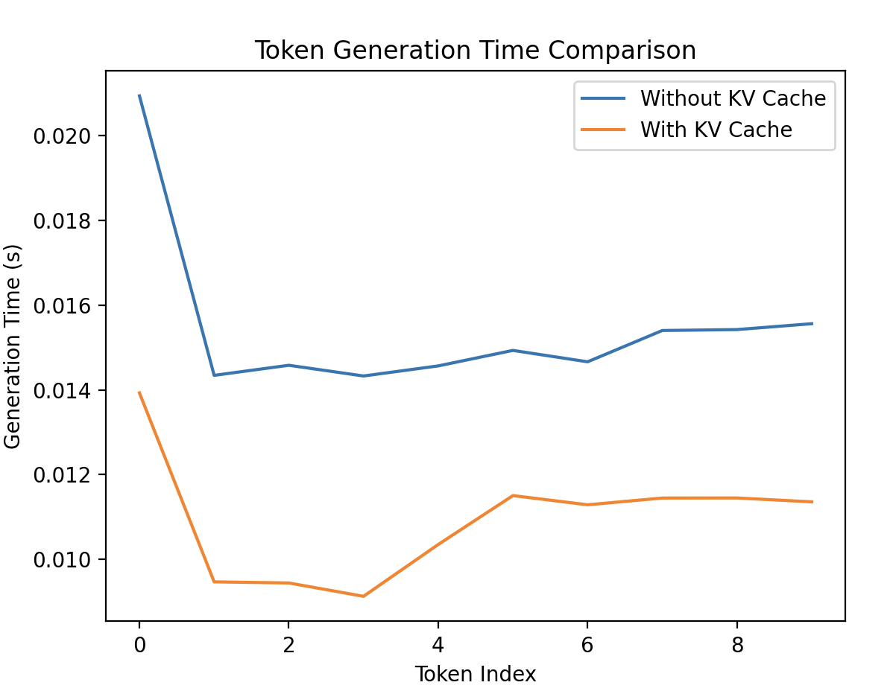

# LLM-Inference
This repository presents key techniques for optimizing inference of large language models (LLMs). The code is adapted from the [*Efficiently Serving LLMs*](https://www.deeplearning.ai/short-courses/efficient-llm-inference/) by DeepLearning.AI and includes my personal annotations and explanations.
## Introduction

Inference optimization techniques for large language models (LLMs) have become a key research focus. As the parameter size of models continues to grow, the computational burden and memory requirements significantly increase, resulting in reduced inference efficiency. Therefore, improving inference speed is crucial.

Quantization techniques reduce memory consumption by lowering the numerical precision of model parameters, thereby accelerating inference. The primary goal is to achieve faster inference with minimal impact on model performance. Currently, quantization methods are mainly divided into two categories:

- **Quantization-Aware Training (QAT)**
- **Post-Training Quantization (PTQ)**, with PTQ being the primary focus of research.

## Details
### 1. GPT-2

The `gpt2_examples` folder provides a detailed demonstration of how the GPT-2 model performs text generation, along with optimization techniques to improve inference speed and efficiency.

#### Batching

**Batching** is the technique of processing multiple input samples in a single forward pass through the model. 
Instead of generating text for one input at a time, batching allows simultaneous computation for many inputs, 
which leads to:

- Better GPU/TPU utilization
- Reduced latency per sample
- Improved throughput in multi-user or production scenarios

#### KV Cache (Key-Value Cache)

**KV Cache** is an optimization used during auto-regressive text generation in transformer models.
Normally, the model recomputes attention over all previous tokens at every step. With KV caching:

- Keys and values from previous tokens are stored
- Only the new token is processed against cached keys/values
- Significantly faster generation, especially for long sequences

This caching mechanism enables efficient inference, particularly useful for chatbot, streaming, 
or server-based applications.
The efficiency improvement can be observed in Figure 1 and Figure 2.

  

     
    Figure 1: Batching
  

  

     
    Figure 2: With and without KV Cache
  

### 2. Quantization
Quantization refers to the process of converting the weights and activations in a Large Language Model from high precision (such as FP32, i.e., 32-bit floating point) to lower precision (such as INT8 or INT4), in order to reduce model size, accelerate inference, and maintain accuracy as much as possible.
